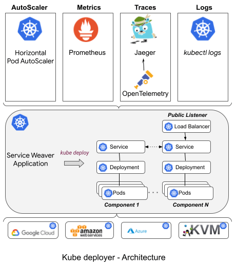
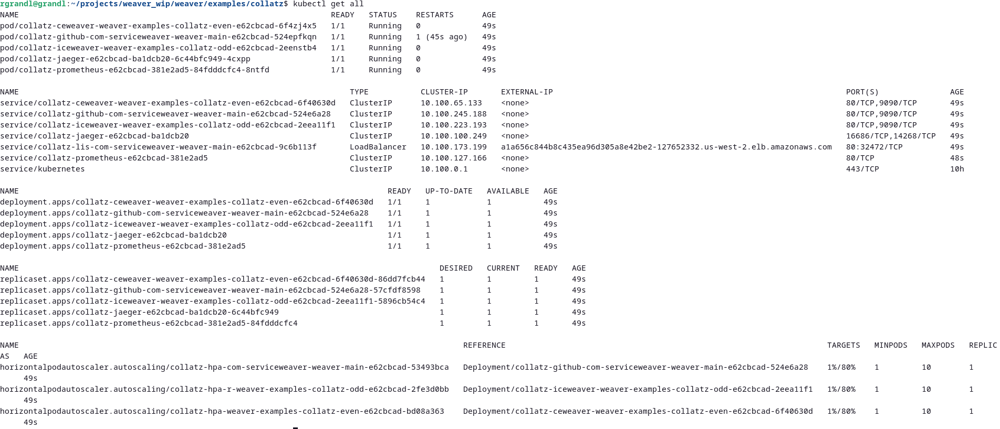
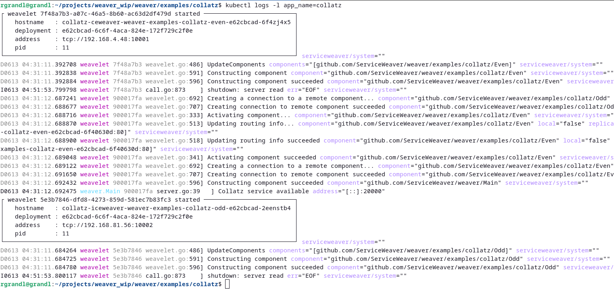
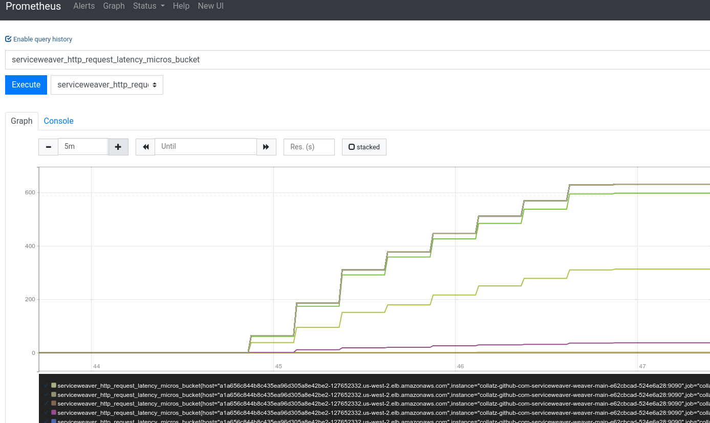
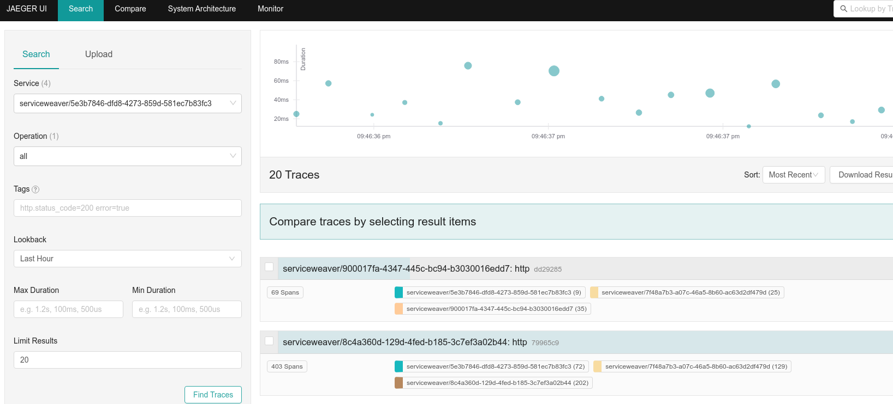

# weaver-kube

This repository contains Go libraries for deploying Service Weaver applications
in any [Kubernetes][kubernetes] environment, i.e. on [GKE][gke], [EKS][eks],
[AKS][aks], [on-prem][kubernetes], etc.

Visit [https://serviceweaver.dev][website] to learn about Service Weaver.

## Overview



The `weaver-kube` deployer builds a [Docker][docker] image for your Service Weaver
application, and generates all the configurations (e.g., Kubernetes [pods][pods],
[deployments][deployment], [services][service], [load balancers][lb]) needed to
run your application on vanilla Kubernetes.

Features:
* Integrates with the Kubernetes [Horizontal Pod Autoscaler][hpa] to scale up/down
your application based on load.
* Logs are accessible via the `kubectl logs` command.
* It uses [Prometheus][prometheus] to aggregate and manipulate the metrics, and
[Jaeger][jaeger] to export and collect traces.

## Installation

### 1. Prerequisites:
* Ensure you have [Go installed][go_install], version 1.20 or higher.
* Make sure you install [kubectl][kubectl].
* Ensure you have Service Weaver [installed][weaver].

### 2. Create a cluster
Make sure you have a Kubernetes cluster up and running. Otherwise, you can use
the commands below to create a cluster in [GKE] or [EKS].

#### GKE

```console
// Install the cloud command.
$ curl https://sdk.cloud.google.com | bash

// Install the GKE authentication plugin.
$ gcloud components install gke-gcloud-auth-plugin

// Initialize the local environment.
$ gcloud init

// Enable google APIs.
$ gcloud services enable container.googleapis.com

// Create a cluster.
$ gcloud container clusters create name --zone=us-central1-a --num-nodes=3 --machine-type=n1-standard-2
```

#### EKS

* Install the `aws` cli command as described [here][aws_cli].
* Install the `eksctl` command as described [here][eksctl].

```console
// Make sure your AWS credentials are correctly generated.
$ aws configure

// Check ~/.aws directory to see if AWS was configured successfully.
// You should have a /config and a /credentials file.
$ ls ~/.aws

// If you want to set a different region as default for your cluster.
$ aws eks update-kubeconfig --region [REGION_NAME]

// Make sure the metrics server is started. One way to do this is to run
// the following command.
$ kubectl apply -f https://github.com/kubernetes-sigs/metrics-server/releases/latest/download/components.yaml

// Create a cluster.
$ eksctl create cluster --name name --region us-west-2 --nodes 3 --node-type t3.small
```

After these steps, if you run `kubectl get nodes`, you should see a Kubernetes
cluster up and running.

### 3. Install the `weaver-kube` command

```console
$ go install github.com/ServiceWeaver/weaver-kube/cmd/weaver-kube@latest
```

Finally, make sure you have a [DockerHub][docker_hub] account, and export your
DockerHub id as follows:

```console
$ export SERVICEWEAVER_DOCKER_HUB_ID=<your_docker_hub_id>
```

Note that the `SERVICEWEAVER_DOCKER_HUB_ID` is required by the `weaver-kube` to
upload your Service Weaver docker image to [DockerHub][docker_hub].

## How to run

### 1. Update the app config

Consider the [collatz][collatz] Service Weaver application. The application has
three components (*main*, *odd*, and *even*), and it runs an HTTP server on a
listener named `collatz` with a `/?x=<value>` endpoint that returns the number's
[hailstone][hailstone] sequence.

To deploy this application to Kubernetes using the `weaver-kube` deployer, first update
the [Service Weaver config file][collatz_config], with the following contents:

```toml
[serviceweaver]
binary = "./collatz"

[kube]
listeners.collatz = {public = true}
```

The `[kube]` section contains the name of all the listeners that are exported by
the application, and can be reached from the public internet. By default, all
listeners are **private**, i.e., accessible only from the cloud project's
internal network.

### 2. Run `weaver-kube deploy`

```console
$ cd collatz
$ weaver-kube deploy weaver.toml
```

The `weaver-kube deploy` command will build a docker image for your application, upload
it to DockerHub, and generate all the Kubernetes pods, deployments, services,
autoscalers for your application as well as Prometheus and Jaeger services. The
output will be saved in a `yaml` file as shown below:


### 3. Deploy the application

Finally, run the `kubectl apply` command to deploy your application into Kubernetes.

```console
$ kubectl apply -f kube_e62cbcad-6c6f-4aca-824e-172f729c2f0e.yaml
```

If you run `kubectl get all` you will see all the instances of your Kubernetes
deployment for your Service Weaver collatz application.



## How to interact with the application

### 1. Public Listeners

For each external listener, `weaver-kube deploy` created a Kubernetes [Load Balancer][lb],
that is listening on port `80`. In our example, it created a load balancer
*a1a656c844b8c435ea96d305a8e42be2-127652332.us-west-2.elb.amazonaws.com* for
the `collatz` public listener. To interact with the application, you can simply run:

```console
$ curl a1a656c844b8c435ea96d305a8e42be2-127652332.us-west-2.elb.amazonaws.com/?x=123456
```

### 2. Logs

To see the logs, simply run `kubectl logs`:

```console
$ kubectl logs -l app_name=collatz
```

The logs should be displayed in the console:



### 3. Metrics

As mentioned before, the Kubernetes deployment runs a [Prometheus][prometheus] service to
export the metrics. In our example, it is *service/collatz-prometheus-e62cbcad-381e2ad5*.

To manipulate the metrics, you can do the following:

```console
// Enable to access the Prometheus service on your local machine.
$ kubectl port-forward service/collatz-prometheus-e62cbcad-381e2ad5 8081:80
```

In your browser, go to `localhost:8081` and you should see something like:



### 4. Traces

As mentioned before, the Kubernetes deployment runs a [Jaeger][jaeger] service to
export the metrics. In our example, it is *service/collatz-jaeger-e62cbcad-ba1dcb20*.

To view the traces, you can do the following:

```console
// Enable to access the Jaeger service on your local machine.
$ kubectl port-forward service/collatz-jaeger-e62cbcad-ba1dcb20 8082:16686
```

In your browser, go to `localhost:8082` and you should see something like:




## Contributing

Please read our [contribution guide](./CONTRIBUTING.md) for details on how
to contribute.

[website]: https://serviceweaver.dev
[arch]: internal/docs/kube_architecture.png
[kubernetes]: https://kubernetes.io/
[gke]: https://cloud.google.com/kubernetes-engine
[eks]: https://aws.amazon.com/eks/
[aks]: https://azure.microsoft.com/en-us/products/kubernetes-service
[kvm]: https://www.linux-kvm.org/page/Main_Page
[pods]: https://kubernetes.io/docs/concepts/workloads/pods/
[rs]: https://kubernetes.io/docs/concepts/workloads/controllers/replicaset/
[deployment]: https://kubernetes.io/docs/concepts/workloads/controllers/deployment/
[service]: https://kubernetes.io/docs/concepts/services-networking/service/
[lb]: https://kubernetes.io/docs/tasks/access-application-cluster/create-external-load-balancer/
[docker]: https://www.docker.com/
[hpa]: https://kubernetes.io/docs/tasks/run-application/horizontal-pod-autoscale/
[prometheus]: https://prometheus.io/
[jaeger]: https://www.jaegertracing.io/
[go_install]: https://go.dev/doc/install
[kubectl]: https://kubernetes.io/docs/reference/kubectl/
[weaver]: https://serviceweaver.dev/docs.html#installation
[eksctl]: https://github.com/weaveworks/eksctl/blob/main/README.md#installation
[aws_cli]: https://docs.aws.amazon.com/cli/latest/userguide/getting-started-install.html
[docker_hub]: https://hub.docker.com/
[collatz]: https://github.com/ServiceWeaver/weaver/tree/main/examples/collatz
[hailstone]: https://mathworld.wolfram.com/HailstoneNumber.html
[collatz_config]: https://github.com/ServiceWeaver/weaver/blob/main/examples/collatz/weaver.toml
