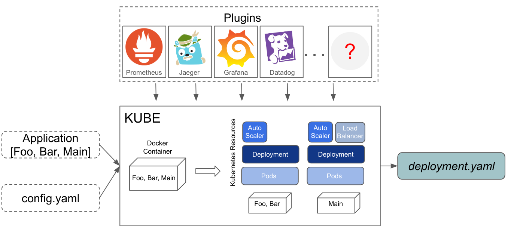

# weaver-kube

This repository contains Go libraries for deploying Service Weaver applications
in any [Kubernetes][kubernetes] environment using the `Kube` deployer.

Visit [https://serviceweaver.dev][website] to learn about Service Weaver.

## Overview

The figure below shows a high level overview of the `weaver kube` deployer. The user
provides an application binary and a configuration file `config.yaml`. The
deployer builds a container image for the application and generates Kubernetes
resources that enable the application to run in a Kubernetes cluster.

Features:
* You control how to run your application (e.g., resource requirements, scaling
  specifications, volumes).
* You decide how to export telemetry (e.g., traces to Jaeger, metrics to Prometheus, write custom plugins).
* You can use existing tools to deploy your application (e.g., [kubectl][kubectl],
  CI/CD pipelines like [Github Actions][githubactions], [Argo CD][argocd] or
  [Jenkins][jenkins]).

## Installation and Getting Started

Visit the `Kube` section of [https://serviceweaver.dev/docs.html][kube_docs]
for installation instructions and information on getting started.

## Contributing

Please read our [contribution guide](./CONTRIBUTING.md) for details on how
to contribute.

[website]: https://serviceweaver.dev
[kube_docs]: https://serviceweaver.dev/docs.html#kube
[kubectl]: https://kubernetes.io/docs/reference/kubectl/
[kubernetes]: https://kubernetes.io/
[githubactions]: https://github.com/features/actions
[argocd]: https://argoproj.github.io/cd/
[jenkins]: https://www.jenkins.io/